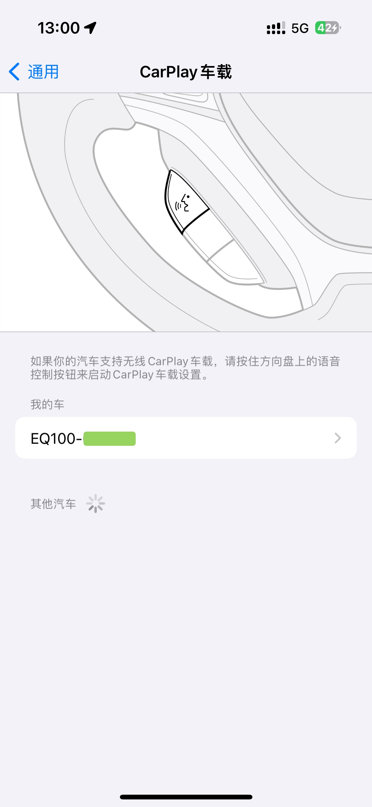

# YunduoApkModify

 宝骏云朵EQ100/五菱星光 原生应用魔改

当前提取应用的系统版本：出厂

| 文件 | 用途 |
|-----|-----|
|SGMWSplitScreen|分屏|
|SGMWBTPhone|蓝牙音频|

## 如何替换安装系统级app？

（以下操作均通过笔记本usb直连，通过adb进行操作）

1. adb root
2. adb shell
3. mount -o rw,remount /
4. rm -r /system/priv-app/(你要删除的对应包名)
5. 修改要安装的app的AndroidManifest.xml文件，删除第一行最高级标签中的 android:sharedUserId="android.uid.system" 元素
6. 将修改、打包、签名完的app放入 /system/priv-app/ 中
7. reboot

## 分屏修改

 修改 Extracted/SGMWSplitScreen/assets/ 中的 host&guest_screen_apps.json ，加入对应包名。

## 蓝牙隐藏修改

 由于EQ100（宝骏云朵）的车机蓝牙可以在iPhone的CarPlay页面中作为一个完整的CarPlay设备被发现（如下图），在此姑且认为其本身是有CarPlay功能，并且可以被修改出来。

 
 
 相关文件：Extracted/SGMWBTPhone/